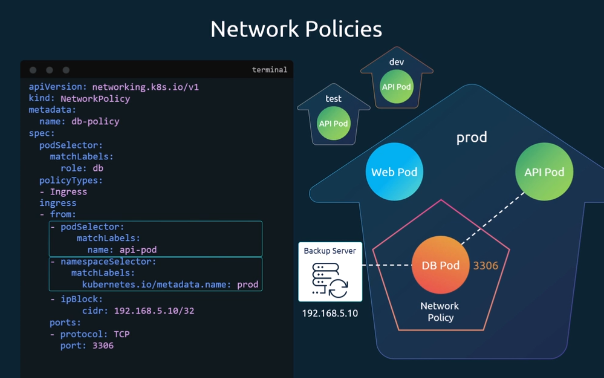

3 Tier Applicatioon

Frontend -> API -> Database

FrontEnd pod will send egress to API which will be ingress for the API and API will send egress which will be ingress for database. 

The traffic originated matters in concepts of ingress and egress, not the response. 

By default, all pods are in k8s cluster can communicate with each other. But this is not ideal. 

To restict pod communication, we make network policies, where we define which ingress and egress should be allowed. 
Then, we add PodSelector Attribute  [where we add the label of the pod] to attach the network policies with pods.

We can have conditions inside ingress like
-  Allow the traffic from the pod with labels role: frontend and its is in the specific namespace

Following are the ingress selectors
- podSelector
- namespaceSelector
- ipBlock

They can be passed as separate elements of list. If passes as separate elements, then it will work as "or operation". 
If combined in one rule, then will be used as "and operation"

