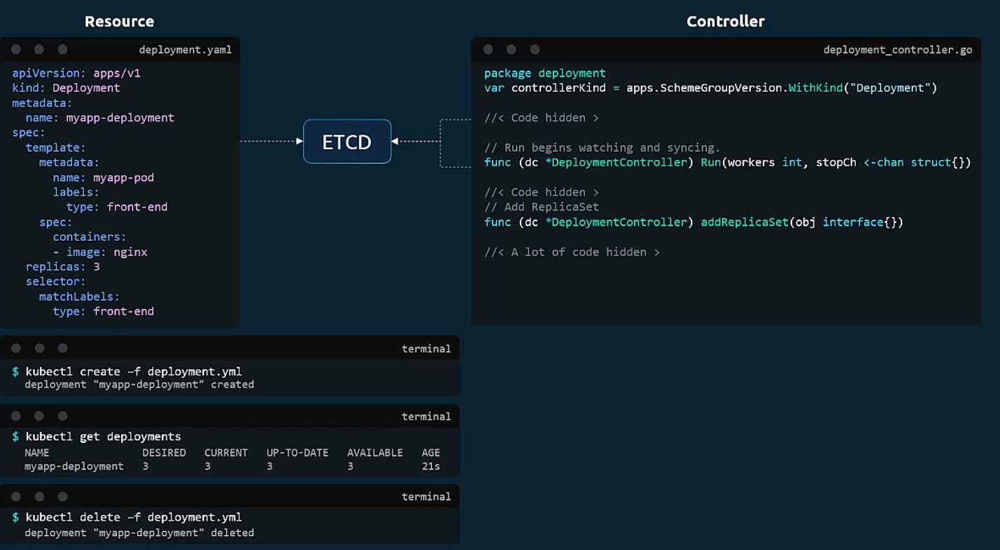

Controller is a process which runs in the backgroud and its job is to monitor the status of resources and make sure what is in the etcd [desired state]
is also reflected in the cluster. Deployment controller keeps the deployment up to date, Replica Controller keeps the number of pods replica 
up to date.

From Docs:

A controller tracks at least one Kubernetes resource type. These objects have a spec field that represents the desired state. The controller(s) for that resource are responsible for making the current state come closer to that desired state.

