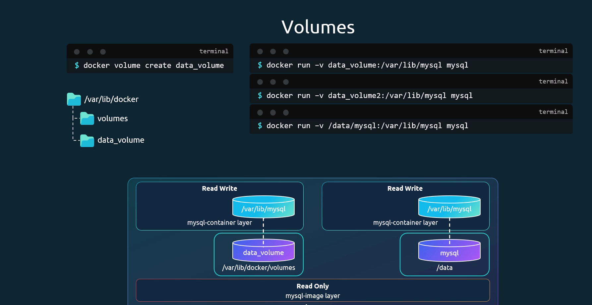

When docker is installed, it created a filesystem at /var/lib/docker which contains folders like
- containers
- image
- volumes

Docker has a layered architecture, 

We can persist data via two ways, 
- by creating the docker volume and then mounting it when containier is created [Volume Mount]
- directly mouting a directory  to other container [Bind Mount]

How docker make sure that data is persisted or layered architecture caches information?
Its done via Storage drivers  like
 - overlay2
 - overlay
 - device mapper

Storage Drivers help manage storage on images and volumes. 
TO persist storage, we need to create volumes [volume mount]

Volume storage can be following 
 - local, if using your own system storage
 - azure file storage if using azure storage

